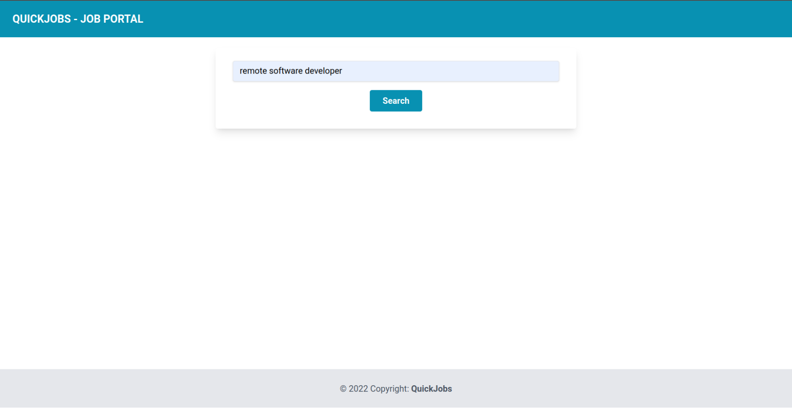
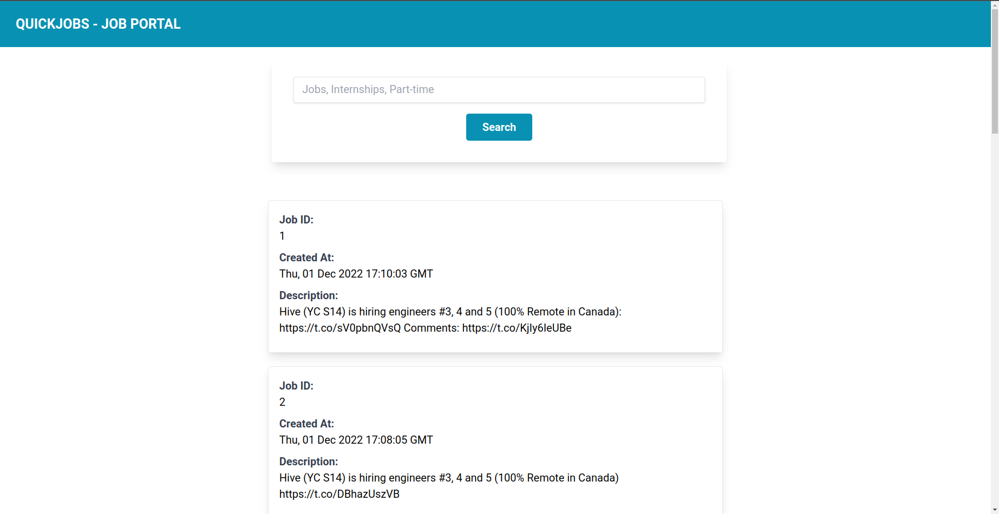
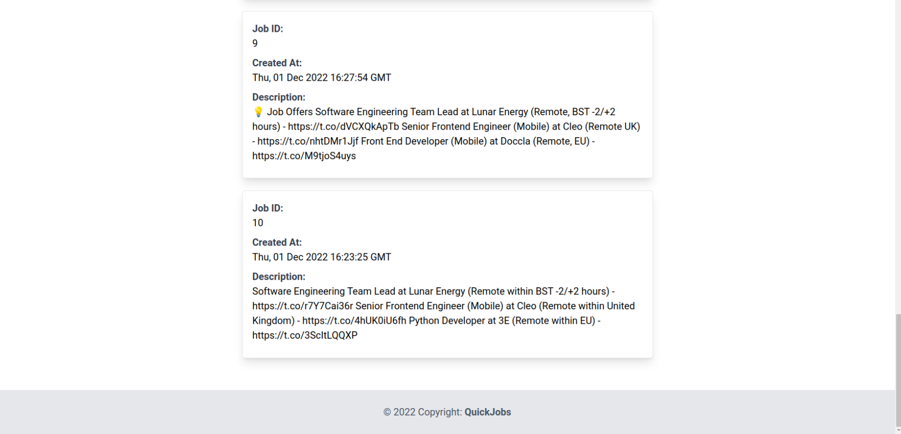

<h1 align="center"> QuickJobs - A Job Portal</h1>

A simple job portal application for real time update of latest jobs with Twitter API.

## Installation
To install all the required libraries run the following command.

`pip install requirements.txt`

To install tailwind, run the following command

`npm install`

Finally sign up for a Twitter Developer account, and create an app and store the bearer token in `credentials.json`.

## Demo

1. Landing page

 </img>

2. Query with a job title

 </img>

3. Get top results matching the job title

 </img>
